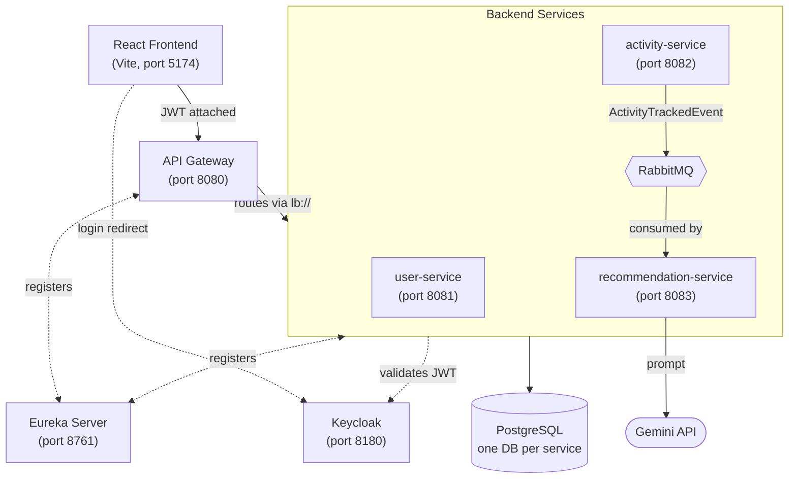

# fitzy

AI-powered fitness tracker built as a Spring Boot microservices platform. Log a workout, and an event-driven pipeline hands it off to Gemini for a personalized coaching breakdown — improvements, forward-looking suggestions, and safety notes — without ever blocking the request that logged it.

This is a from-scratch architectural rebuild of an earlier monolith-leaning version of the same idea, redesigned around proper service boundaries, centralized cross-cutting concerns, and a real security layer.

---

## Architecture




https://github.com/user-attachments/assets/387f1226-3e08-40ca-82e6-03b6881a6b62


**Request flow:** the frontend never talks to a service directly — every call goes through the gateway, which resolves the target service's live location via Eureka rather than a hardcoded port. Every service independently verifies the caller's JWT against Keycloak's public key; there's no implicit trust between the gateway and the services behind it.

**Async flow:** logging an activity returns immediately once saved. `activity-service` publishes an event to RabbitMQ and moves on — it has no idea `recommendation-service` even exists. `recommendation-service` picks the event up on its own schedule, calls Gemini, and persists the result. The frontend finds out it's ready by polling, not by blocking the original request.

---

## Services

| Service | Port | Responsibility |
|---|---|---|
| `eureka-server` | 8761 | Service registry — every other service registers here on startup |
| `api-gateway` | 8080 | Single entry point; routes by path to the right service via Eureka, handles CORS |
| `user-service` | 8081 | User profiles (biometric data used to personalize AI output) |
| `activity-service` | 8082 | Logs workouts, publishes `ActivityTrackedEvent` to RabbitMQ on save |
| `recommendation-service` | 8083 | Consumes activity events, calls Gemini, persists AI-generated coaching feedback |
| `fitzy-common` | — | Shared library (not a runnable service): exception hierarchy, global error handling, shared Kafka/RabbitMQ event contracts |
| `frontend` | 5174 | React SPA — training-log visual identity, live polling UI for AI results |

---

## Tech stack

**Backend:** Java 21 · Spring Boot 3 · Spring Cloud (Eureka, Gateway) · Spring Data JPA · Spring Security (OAuth2 Resource Server) · Spring AMQP (RabbitMQ) · Hibernate · PostgreSQL · MapStruct · Lombok
**AI:** Google Gemini API (JSON-mode structured output)
**Auth:** Keycloak (delegated authentication, JWT validation independently per service)
**Frontend:** React 18 · Vite · Tailwind CSS v4 · React Router · Axios · `keycloak-js`
**Infra:** Docker (Postgres, RabbitMQ, Keycloak)

---

## Key design decisions

A few choices worth knowing the reasoning behind, since none of them were defaults — each was a deliberate tradeoff:

- **RabbitMQ over Kafka.** The actual shape of this problem is simple pub/sub between two services — no need for partitioned replay logs or independent consumer groups reading the same stream. Kafka's real strengths don't get exercised here; reaching for it anyway would've been optimizing for "sounds impressive" over "correctly sized for the problem."
- **No Config Server.** Three services with a handful of properties each doesn't justify the operational overhead of centralizing config — that tool earns its place once config duplication across *many* services becomes a real maintenance problem, which isn't the case here yet.
- **Every service validates JWTs independently**, rather than trusting the gateway to do it once. Defense in depth — a compromised or misconfigured gateway can't silently become a backdoor into every service behind it.
- **No password field anywhere in `User`.** Authentication is fully delegated to Keycloak; services only ever see a signed, verified token, never a raw credential.
- **Denormalized `userId` onto `Recommendation`**, even though it's technically derivable from the related `Activity`. Avoids a cross-service call just to answer "show me this user's recommendations" — a deliberate, named tradeoff (denormalization for service independence), not an oversight.
- **Optimistic locking (`@Version`) on every entity**, protecting against silently lost updates on concurrent writes.
- **Gemini's JSON response mode**, not prompt-engineered "please respond in JSON." Forces strictly valid JSON back from the model, removing the fragile markdown-fence-stripping parsing a naive integration would need.
- **Retry + fallback on AI failure.** Gemini's free tier is rate-limited; a transient failure now retries with backoff, and if it still fails, the activity gets an honest fallback recommendation instead of silently never getting one at all.
- **`ddl-auto: update`, no Flyway.** A deliberate speed-over-rigor tradeoff for this stage of the project — schema is simple enough that hand-managed migrations weren't yet earning their cost. Documented here rather than pretending it's not a shortcut.

---

## Getting started

### Prerequisites
- JDK 21, Maven
- Node.js 18+
- Docker Desktop

### 1. Start infrastructure

```bash
docker run -d --name postgres-db -p 5432:5432 -e POSTGRES_USER=postgres -e POSTGRES_PASSWORD=<your_password> -e POSTGRES_DB=mydb postgres:16
docker run -d --name rabbitmq -p 5672:5672 -p 15672:15672 rabbitmq:3-management
docker run -d --name keycloak -p 8180:8080 -e KEYCLOAK_ADMIN=admin -e KEYCLOAK_ADMIN_PASSWORD=admin quay.io/keycloak/keycloak:25.0.6 start-dev
```

Create the remaining databases:
```bash
docker exec -it postgres-db psql -U postgres -c "CREATE DATABASE user_db;"
docker exec -it postgres-db psql -U postgres -c "CREATE DATABASE recommendation_db;"
```

### 2. Configure Keycloak

- Open `http://localhost:8180`, log in with `admin` / `admin`
- Create a realm named `FITzy`
- Create a client `fitzy-app` — public client, with valid redirect URI `http://localhost:5174/*` and web origin `http://localhost:5174`
- Create at least one user, set a permanent (non-temporary) password, mark email as verified

### 3. Configure each service

Every service's real `application.yml`/`application.yaml` is gitignored (contains local credentials). Copy the matching `.example` file in each service's `src/main/resources/` folder, rename it (drop `.example`), and fill in your actual DB password.

`recommendation-service` additionally needs a Gemini API key, set as an environment variable (not in the yml):
```
GEMINI_API_KEY=your_key_from_ai_studio
```

### 4. Build the shared library

```bash
cd fitzy-common
mvn clean install
```

### 5. Start the backend, in order

1. `eureka-server`
2. `user-service`, `activity-service`, `recommendation-service` (any order)
3. `api-gateway` last

Confirm all four registered at `http://localhost:8761`.

### 6. Start the frontend

```bash
cd frontend
npm install
npm run dev
```

Visit `http://localhost:5174` — you'll be redirected to Keycloak's login page.

---

## API reference

All requests go through the gateway at `http://localhost:8080`, with `Authorization: Bearer <jwt>` on every call.

| Method | Path | Description |
|---|---|---|
| `POST` | `/api/v1/users` | Create the caller's profile (idempotent — safe to call more than once) |
| `GET` | `/api/v1/users/{id}` | Get a profile (403 if not the caller's own) |
| `POST` | `/api/v1/activities` | Log an activity; publishes an event for async AI processing |
| `GET` | `/api/v1/activities/{id}` | Get a single activity (403 if not the caller's own) |
| `GET` | `/api/v1/activities?page=&size=&sort=` | Paginated list of the caller's activities |
| `GET` | `/api/v1/recommendations/activity/{activityId}` | Get the AI recommendation for an activity (404 while still generating — intended for polling) |
| `GET` | `/api/v1/recommendations?page=&size=` | Paginated list of the caller's recommendations |

---

## License

MIT
